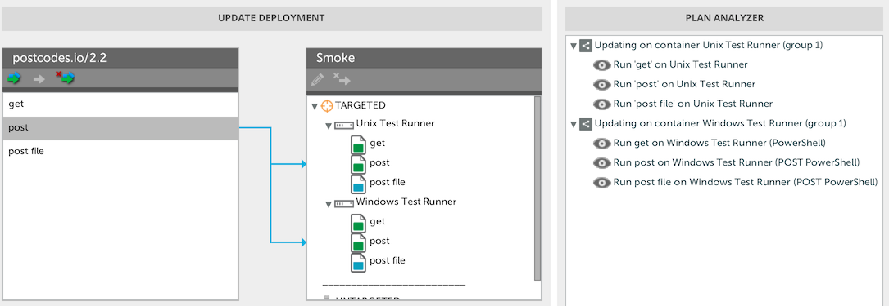

# Smoke Test plugin #

# Overview #

The Smoke Test plugin is an XL Deploy plugin that triggers http requests at the end of the deployment task. It uses either `wget` executable file (Unix / Windows) or `Invoke-WebRequest` PowerShell cmdlet (Windows).

# Requirements #

* **Deployit requirements**
	* **Deployit**: version 4.5.+

# Installation #

Place the plugin JAR file into your `SERVER_HOME/plugins` directory.

# Usage #

A `smoketest.Runner` CI is a container from which the test will be performed.

3 Deployables are provided that will be deployed onto a `smoketest.Runner`

* `smoketest.HttpRequestTest` for a HTTP request using the GET verb
* `smoketest.HttpPostRequestTest` for a HTTP request using the POST verb
* `smoketest.HttpPostRequestFileTest` for a HTTP request using the POST verb and a file that contains the post data.

# Note #

On Unix hosts, the plugin will use `wget`that should be already installed.
On Windows hosts, there are 2 options

* use a version of `wget` bundled in the plugin and uploaded to perform the http request. (default option)
* use a PowerShell implementation. To activate this option you need to
** enable the property powershellInstalled` on the `smoketest.Runner`
** install PowerShell v3+ on the remote Windows Host.

If you wish to use a _different_ `wget` that is _already present_ on the path of your target systems you can simply prevent the included version from being uploaded by modifying `SERVER_HOME/conf/deployit-defaults.properties` as follows:

	# Classpath Resources
	# smokeTest.ExecutedHttpRequestTest.classpathResources=smoketest/runtime/wget.exe

to

	# Classpath Resources
	smokeTest.ExecutedHttpRequestTest.classpathResources=

